# Detalle de flujos n8n PE01–PE12

Este documento describe cómo debe funcionar cada flujo para conectarse con Supabase mediante Edge Functions, guardar la información y alimentar las conversaciones del dashboard. Complementa a [n8n-edge-functions-dashboard.md](./n8n-edge-functions-dashboard.md).

## Regla común para todos los flujos

Los JSON de `flujos/` reciben un evento HTTP y no deben conectarse directamente a PostgreSQL. Cada flujo debe usar los siguientes nodos lógicos:

1. **Webhook Trigger**: recibe el evento.
2. **Validate envelope**: valida secreto, `workflow_code`, UUIDs y campos obligatorios.
3. **Check idempotency**: consulta la ejecución o evento existente mediante Edge Function.
4. **Read context**: obtiene únicamente los datos necesarios del caso, conversación o entidad.
5. **Business step**: ejecuta la lógica propia del PE.
6. **Persist result**: llama a `workflow-bridge` con el resultado estructurado.
7. **Callback**: `webhooks` actualiza la ejecución, acción, mensajes y eventos.
8. **Respond**: devuelve `200` para resultado aceptado o `202` para procesamiento asíncrono.

### Sobre de entrada

```json
{
  "event_type": "case_message",
  "workflow_code": "PE05",
  "request_id": "uuid",
  "correlation_id": "uuid",
  "idempotency_key": "case-message:uuid",
  "organization_id": "uuid",
  "user_id": "uuid|null",
  "case_id": "uuid|null",
  "conversation_id": "uuid|null",
  "source_message_id": "uuid|null",
  "action_id": "uuid|null",
  "workflow_execution_id": "uuid",
  "input_data": {}
}
```

### Sobre de salida

```json
{
  "workflow_execution_id": "uuid",
  "n8n_execution_id": "string",
  "organization_id": "uuid",
  "workflow_code": "PE05",
  "case_id": "uuid|null",
  "conversation_id": "uuid|null",
  "source_message_id": "uuid|null",
  "status": "success|failed|waiting|cancelled",
  "idempotency_key": "callback:uuid",
  "output_data": {},
  "error_data": {}
}
```

### Reglas de persistencia

- `workflow_execution_id` es el vínculo interno principal.
- `n8n_execution_id` solo es referencia externa.
- `organization_id` debe verificarse en cada lectura y escritura.
- `case_id` y `conversation_id` deben pertenecer a la misma organización.
- Los callbacks repetidos deben producir una respuesta idempotente y no insertar datos nuevamente.
- Los mensajes generados por n8n usan `sender_type = 'ai'` o `sender_type = 'workflow'`, según corresponda.
- Los mensajes de sistema no deben confundirse con respuestas de IA.
- Un flujo no debe declarar éxito si la persistencia en Edge Function falló.

## PE01 — Intake de correo y creación/correlación de caso

### Propósito

Recibir un correo de Outlook, registrar el correo, encontrar el caso correspondiente o crear uno nuevo según las reglas de negocio y abrir la conversación operativa.

### Entrada mínima

- `organization_id`;
- `external_message_id`;
- remitente, asunto y cuerpo;
- fecha de recepción;
- referencias externas disponibles.

### Lecturas

- `cases` para correlación;
- `contacts` para identificar al cliente;
- `emails` para comprobar duplicados;
- `conversations` para localizar el hilo existente.

### Escrituras

- `emails`;
- `cases`, solo cuando las reglas permitan crear el caso;
- `conversations` con `conversation_type = 'case'`;
- `messages` con el correo de origen;
- `workflow_executions` y `workflow_events`.

### Flujo

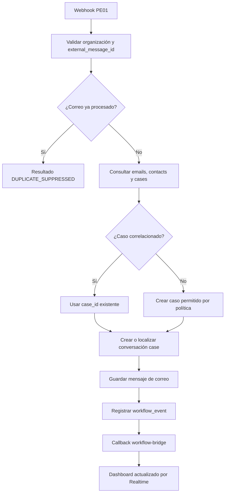

### Reglas críticas

- La clave idempotente debe incluir `external_message_id`.
- Si hay dos casos posibles, no se debe elegir automáticamente: devolver `REQUIRE_APPROVAL` o atención humana.
- El cuerpo del correo se guarda en `messages.content` o `emails.body_text`, sin duplicar innecesariamente el contenido.

## PE02 — Evaluación de autoridad y aprobación

### Propósito

Determinar si una acción sobre un caso puede ejecutarse automáticamente o requiere aprobación humana.

### Entrada mínima

- `case_id`;
- `action_id`;
- solicitud de acción;
- usuario que solicita;
- contexto del caso.

### Lecturas

- `cases`;
- `messages`;
- `actions`;
- reglas de organización en `configuration` o la fuente de políticas vigente;
- `approvals` existentes.

### Escrituras

- `approvals`;
- `messages.content_json` con la decisión y reglas aplicadas;
- `cases.status` cuando la decisión cambie el estado;
- `workflow_events`;
- `actions.output_data` cuando corresponda.

### Flujo

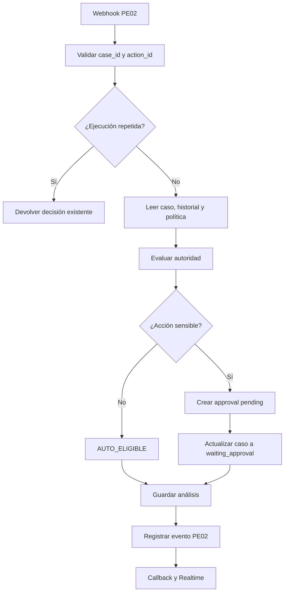

### Reglas críticas

- PE02 puede crear una aprobación, pero no debe aprobarla por sí mismo.
- `approval_id` debe quedar relacionado con `action_id` y `case_id`.
- Una aprobación repetida debe devolver la aprobación original.

## PE03 — Preparación de borrador

### Propósito

Generar una respuesta o documento para revisión, sin enviarlo al cliente.

### Entrada mínima

- `case_id`;
- `conversation_id`;
- contenido del pedido;
- `action_id` opcional.

### Lecturas

- historial de `messages`;
- `emails` asociados;
- datos de `cases` y `contacts`;
- aprobaciones vigentes.

### Escrituras

- mensaje IA con el borrador;
- `actions.output_data` si el borrador forma parte de una acción;
- `workflow_events`.

### Flujo

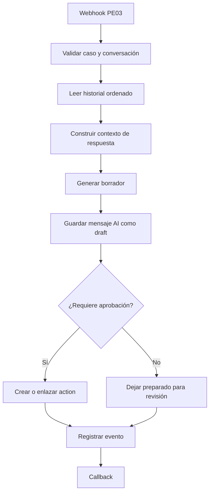

### Regla crítica

PE03 nunca debe escribir `delivery_attempts` como exitoso ni marcar un correo como enviado. La entrega corresponde a PE07 y su confirmación a PE10.

## PE04 — Delegación y asignación

### Propósito

Asignar un caso a una persona y/o departamento válido dentro de la organización.

### Entrada mínima

- `case_id`;
- `assigned_to`;
- `department_id` opcional;
- motivo;
- `action_id`.

### Lecturas

- `cases`;
- `users`;
- `departments`;
- delegaciones activas.

### Escrituras

- `cases.assigned_to` y `cases.department_id`;
- `delegations`;
- mensaje de sistema;
- `workflow_events`.

### Flujo

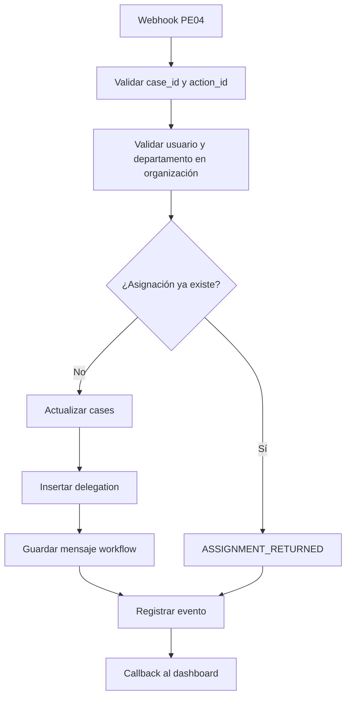

### Regla crítica

Nunca se debe aceptar `assigned_to` solo porque venga en el payload. Debe existir, pertenecer a la organización y ser elegible para recibir el caso.

## PE05 — Conversación de caso

### Propósito

Procesar los mensajes enviados desde `src/app/(dashboard)/cases/[id]/page.tsx` y guardar la respuesta dentro del mismo hilo.

### Entrada mínima

- `case_id`;
- `conversation_id`;
- `source_message_id`;
- contenido del mensaje;
- `workflow_execution_id`.

### Lecturas

- `cases`;
- `conversations`;
- `messages` del hilo;
- información relacionada al caso.

### Escrituras

- respuesta en `messages`;
- `conversations.updated_at`;
- cambio de estado del caso, solo si la regla lo indica;
- `workflow_events`;
- `workflow_executions.output_data`.

### Flujo

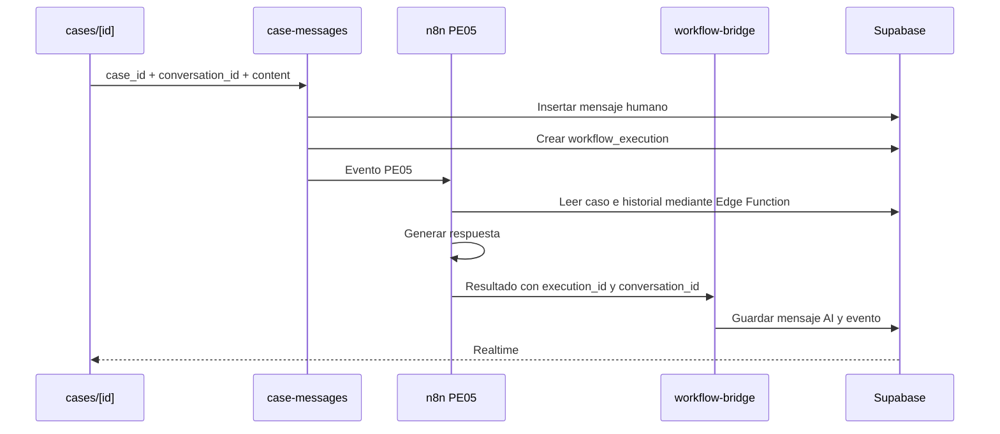

### Reglas críticas

- La respuesta debe usar el mismo `case_id` y `conversation_id` del mensaje origen.
- Si n8n falla, el mensaje humano permanece guardado y la ejecución queda `failed`.
- PE05 no puede crear una nueva conversación para cada mensaje.

## PE06 — Seguimientos y vencimientos

### Propósito

Procesar seguimientos programados, intentos, vencimientos y próximos contactos.

### Entrada mínima

- `case_id`;
- `follow_up_id`;
- fecha de ejecución;
- tipo de seguimiento.

### Lecturas

- `follow_ups`;
- `cases`;
- `conversations`;
- último intento y estado.

### Escrituras

- `follow_ups.attempt_count`;
- `last_attempt_at`;
- `status` y `completed_at`;
- mensaje o notificación;
- `workflow_events`.

### Flujo

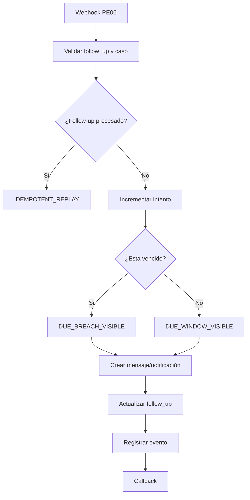

### Regla crítica

No se deben insertar seguimientos nuevos como efecto secundario de un reintento del mismo `follow_up_id`.

## PE07 — Entrega de respuesta

### Propósito

Enviar una respuesta previamente preparada y autorizada por correo o WhatsApp.

### Entrada mínima

- `case_id`;
- `conversation_id`;
- `draft_id` o `message_id`;
- canal y destinatario;
- `approval_id` cuando sea necesario.

### Lecturas

- borrador;
- aprobación;
- caso y conversación;
- historial de entregas.

### Escrituras

- `delivery_attempts`;
- mensaje de salida;
- `actions.output_data`;
- `workflow_events`.

### Flujo

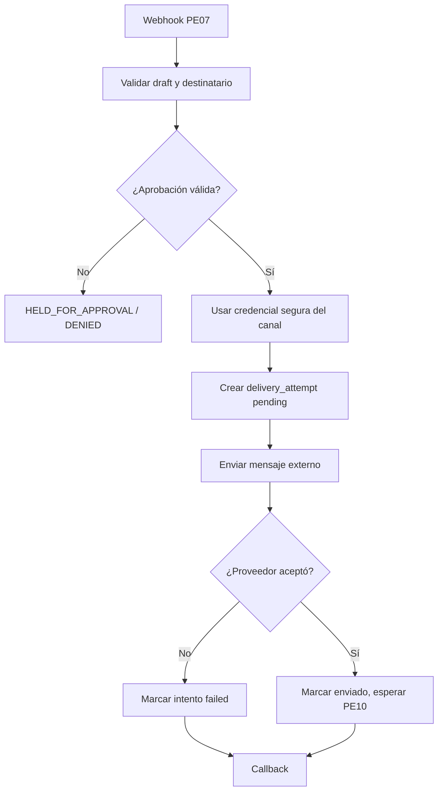

### Reglas críticas

- No guardar tokens ni credenciales en la base de datos.
- No marcar `DELIVERY_CONFIRMED` en PE07; esa confirmación corresponde a PE10.
- La clave de entrega debe ser idempotente por mensaje y canal.

## PE08 — Comandos del asistente

### Propósito

Procesar mensajes de `src/app/(dashboard)/assistant/page.tsx`, consultar el contexto operativo y devolver texto y acciones estructuradas.

### Entrada mínima

- `conversation_id`;
- `source_message_id`;
- texto del usuario;
- `case_id` opcional;
- contexto operativo.

### Lecturas

- conversaciones y mensajes;
- casos pendientes;
- aprobaciones pendientes;
- seguimientos pendientes;
- acciones abiertas.

### Escrituras

- respuesta IA en `messages`;
- `actions` si el usuario debe confirmar una acción;
- `workflow_events`;
- ejecución del workflow.

### Flujo

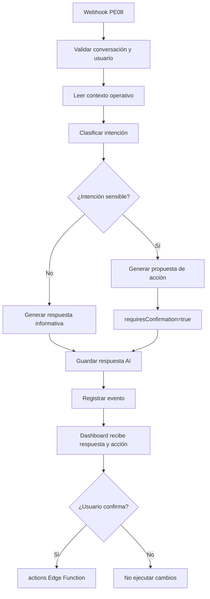

### Regla crítica

El frontend no debe interpretar acciones mediante expresiones regulares. Debe utilizar únicamente el objeto estructurado devuelto por PE08.

## PE09 — Correlación de conversación, correo y caso

### Propósito

Asociar una conversación o referencia externa con el caso correcto.

### Entrada mínima

- `organization_id`;
- referencias externas;
- `conversation_id` o `itemRef`;
- señales de correlación.

### Lecturas

- `emails`;
- `cases`;
- `conversations`;
- `external_references` cuando exista.

### Escrituras

- `conversations.case_id`;
- `emails.case_id`;
- `workflow_events`;
- atención humana si la confianza es insuficiente.

### Flujo

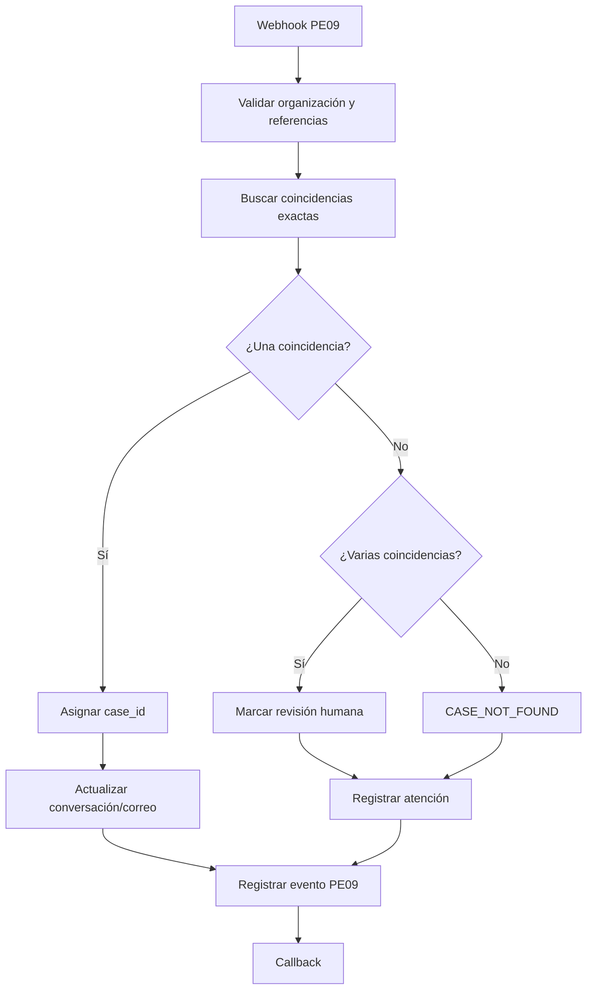

### Regla crítica

Nunca correlacionar solo por título o texto libre cuando existan varias coincidencias posibles.

## PE10 — Confirmación de entrega

### Propósito

Procesar el recibo del proveedor de correo o WhatsApp y cerrar el ciclo de entrega.

### Entrada mínima

- `delivery_id`;
- `external_id`;
- estado del proveedor;
- fecha del recibo;
- organización.

### Lecturas

- `delivery_attempts`;
- `actions`;
- mensaje enviado;
- caso y conversación relacionados.

### Escrituras

- estado de `delivery_attempts`;
- `messages.metadata` con confirmación;
- `workflow_events`;
- acción relacionada.

### Flujo

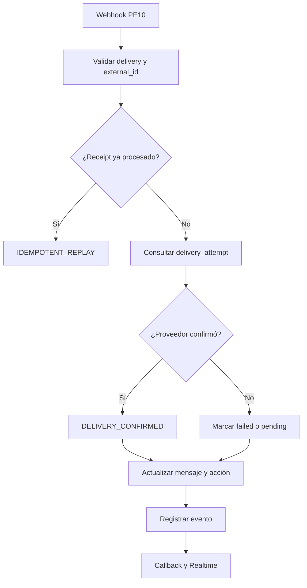

### Regla crítica

El recibo debe estar asociado a la entrega correcta. No se debe actualizar el último envío del caso por posición o fecha.

## PE11 — Cobertura y observabilidad

### Propósito

Comprobar si las fuentes y ejecuciones requeridas están completas, degradadas o desactualizadas.

### Entrada mínima

- `organization_id`;
- `case_id` opcional;
- fuentes requeridas;
- fecha de observación.

### Lecturas

- `workflow_executions`;
- `workflow_events`;
- mensajes y entregas relacionados;
- definiciones de workflow.

### Escrituras

- `workflow_events`;
- resultado de cobertura;
- acciones de atención cuando falte una fuente.

### Flujo

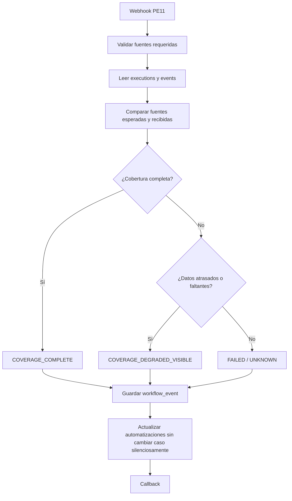

### Regla crítica

PE11 observa y registra. No debe cerrar, resolver ni reasignar casos como efecto lateral de un cálculo de cobertura.

## PE12 — Verificación, resolución y cierre

### Propósito

Aplicar transiciones autorizadas de verificación, resolución, cierre o reapertura.

### Entrada mínima

- `case_id`;
- `action_id`;
- transición;
- usuario;
- evidencia;
- `expected_version`.

### Lecturas

- estado actual del caso;
- rol del usuario;
- eventos anteriores;
- aprobaciones;
- evidencia o mensajes asociados.

### Escrituras

- `cases.status`;
- `cases.closed_at` cuando corresponda;
- mensaje de sistema;
- `workflow_events`;
- acción y ejecución.

### Flujo

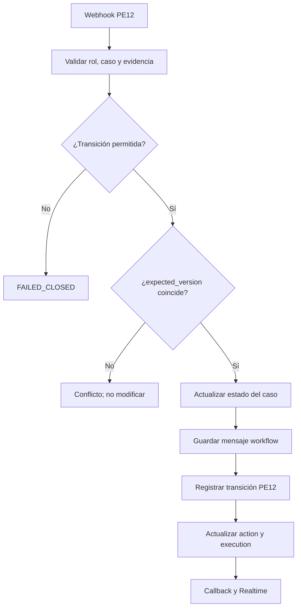

### Reglas críticas

- n8n no debe cerrar un caso sin una orden explícita, autorizada y trazable.
- Una versión desactualizada no debe sobrescribir el estado actual.
- Un cierre repetido debe devolver resultado idempotente sin insertar otra transición.
- Una reapertura debe conservar la evidencia del cierre anterior.

## Matriz final de persistencia

| Flujo | Entidades principales | Resultado visible |
|---|---|---|
| PE01 | `emails`, `cases`, `conversations`, `messages` | Caso y conversación creados/correlacionados |
| PE02 | `approvals`, `actions`, `messages`, `cases` | Decisión y aprobación pendiente |
| PE03 | `messages`, `actions` | Borrador de respuesta |
| PE04 | `cases`, `delegations`, `messages` | Caso asignado |
| PE05 | `messages`, `conversations`, `cases` | Respuesta del chat del caso |
| PE06 | `follow_ups`, `messages`, `notifications` | Seguimiento actualizado |
| PE07 | `delivery_attempts`, `messages`, `actions` | Entrega iniciada |
| PE08 | `messages`, `actions`, `workflow_executions` | Respuesta del asistente |
| PE09 | `conversations`, `emails`, `workflow_events` | Caso correlacionado o revisión humana |
| PE10 | `delivery_attempts`, `messages`, `workflow_events` | Entrega confirmada o fallida |
| PE11 | `workflow_events`, `workflow_executions` | Cobertura visible |
| PE12 | `cases`, `messages`, `workflow_events`, `actions` | Caso verificado, resuelto, cerrado o reabierto |

## Checklist antes de activar un flujo

- [ ] El webhook valida el secreto de entrada.
- [ ] El `workflow_code` coincide con el archivo importado.
- [ ] Se conserva `workflow_execution_id` desde Edge Function hasta callback.
- [ ] Existe una clave idempotente estable.
- [ ] Las lecturas se limitan a `organization_id`.
- [ ] `case_id` y `conversation_id` se validan conjuntamente.
- [ ] El resultado se guarda mediante `workflow-bridge`.
- [ ] El callback se prueba dos veces con el mismo payload.
- [ ] El dashboard muestra el resultado mediante Realtime.
- [ ] Las credenciales no aparecen en el JSON ni en `input_data`.
- [ ] El flujo no se activa hasta completar una prueba real con datos de prueba.
