# Guía operativa de n8n: nodos que se mueven y nodos que se crean

Esta guía indica exactamente qué modificar en n8n para que los workflows PE01–PE13 utilicen el motor compartido, Supabase Edge Functions y la base de datos sin duplicar decisiones ni perder la correlación de casos.

Complementa:

- [n8n-edge-functions-dashboard.md](./n8n-edge-functions-dashboard.md)
- [detalle-flujos-pe01-pe12.md](./detalle-flujos-pe01-pe12.md)

## Regla principal

El motor no vive dentro de un workflow aislado. Es un servicio compartido.

El punto formal donde se solicita una decisión de autoridad es **PE02**. PE06 también consulta al motor, pero únicamente para decisiones de tiempo y seguimiento. Los demás workflows ejecutan, observan, correlacionan o registran resultados.

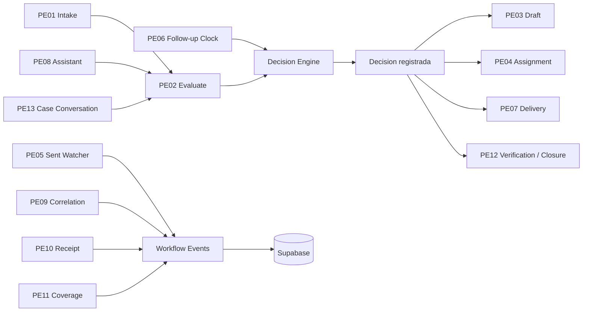

# 1. Antes de mover nodos

## Variables de entorno de n8n

Configura estas variables en la instancia de n8n:

```env
PROLOGISTICA_EDGE_FUNCTION_URL=https://<project-ref>.supabase.co/functions/v1
N8N_INGRESS_SECRET=<secret-para-llamadas-a-edge>
N8N_WEBHOOK_SECRET=<secret-para-callbacks>
```

No coloques valores reales dentro de los JSON exportados.

## Credenciales n8n

Crear dos credenciales HTTP o equivalentes:

1. `Prologistica Edge Ingress`
   - Header: `x-prologistica-secret`
   - Valor: `N8N_INGRESS_SECRET`

2. `Prologistica Edge Callback`
   - Header: `x-n8n-webhook-secret`
   - Valor: `N8N_WEBHOOK_SECRET`

Las credenciales de Outlook, WhatsApp o proveedores externos deben permanecer exclusivamente en n8n.

## Eliminar nodos de laboratorio

En cada workflow PE01–PE12:

1. Eliminar el nodo `Fetch injected local command`.
2. Eliminar o desconectar las llamadas `C05 ...` que apunten al motor local.
3. Eliminar URLs `127.0.0.1:8765`.
4. Eliminar nodos que creen resultados ficticios o referencias `local://` para producción.
5. Conservar los nodos de validación del contrato solo después de adaptarlos al sobre real.
6. Mantener `active = false` hasta completar una prueba real.

El cuerpo que llega desde una Edge Function debe entrar directamente desde el webhook al validador. No se debe reemplazar por una segunda llamada HTTP que pierda el payload original.

# 2. Plantilla de nodos común

Cada workflow operativo debe seguir esta secuencia:

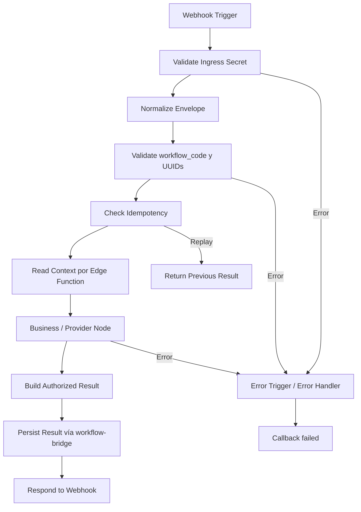

## Nodos que deben existir

### 1. Webhook Trigger

Configuración:

```text
HTTP Method: POST
Path: prologistica-peXX
Response Mode: Using Respond to Webhook Node
```

El path debe coincidir con el cliente Edge Function:

```text
PE02 → /webhook/prologistica-pe02
PE06 → /webhook/prologistica-pe06
PE13 → /webhook/prologistica-pe13
```

### 2. Validate Ingress Secret

Un nodo `Code` o validación equivalente debe comprobar:

```js
$json.organization_id
$json.workflow_code
$json.workflow_execution_id
$json.request_id
$json.correlation_id
$json.idempotency_key
```

La autenticación principal del webhook debe ocurrir mediante credencial/header de n8n o configuración equivalente. No confiar en un `organization_id` recibido sin asociarlo a la ejecución almacenada.

### 3. Normalize Envelope

Debe mantener los nombres internos sin traducirlos de forma ambigua:

```text
organization_id
case_id
conversation_id
source_message_id
action_id
workflow_execution_id
```

No cambiar `case_id` por `caseNumber`, `conversation_id` por `thread`, ni `workflow_execution_id` por `n8n_execution_id`.

### 4. Check Idempotency

Usar un nodo `HTTP Request` hacia una Edge Function de lectura o una operación equivalente. No consultar PostgreSQL directamente.

Si la clave ya fue procesada:

```text
no ejecutar proveedor externo
no crear otro mensaje
no crear otra delegación
no enviar otro correo
devolver resultado anterior
```

### 5. Read Context

Usar `HTTP Request` hacia una Edge Function segura que lea únicamente el contexto requerido. No usar `SELECT *` ni credenciales de base de datos administrativas en nodos genéricos.

### 6. Persist Result

Usar un nodo `HTTP Request` con:

```text
Method: POST
URL: {{$env.PROLOGISTICA_EDGE_FUNCTION_URL}}/workflow-bridge
Header: x-prologistica-secret
```

El cuerpo debe incluir el `workflow_execution_id` original.

### 7. Error Handler

Cada workflow debe tener una rama de error que llame a `workflow-bridge` con:

```json
{
  "status": "failed",
  "error_data": {
    "code": "WORKFLOW_FAILED",
    "message": "Error sanitizado"
  }
}
```

No guardar tokens, cuerpos completos con credenciales ni secretos en `error_data`.

# 3. PE01 — Outlook Intake

## Nodos a mover

- Mover `Fetch injected local command` fuera de la ruta principal y eliminarlo.
- Mover la lectura de Outlook al inicio del workflow.
- Mover la validación de contrato después de la normalización del correo.
- Mover la correlación después de `Check Idempotency`.

## Nodos a crear

1. `Webhook Trigger — PE01`.
2. `Normalize Outlook Message`.
3. `Check Email Idempotency`.
4. `Read Case Correlation Context`.
5. `Send Intake to Edge Function`.
6. `Build PE01 Result`.
7. `Persist PE01 Result`.
8. `Respond PE01`.
9. `PE01 Error Callback`.

## Conexiones

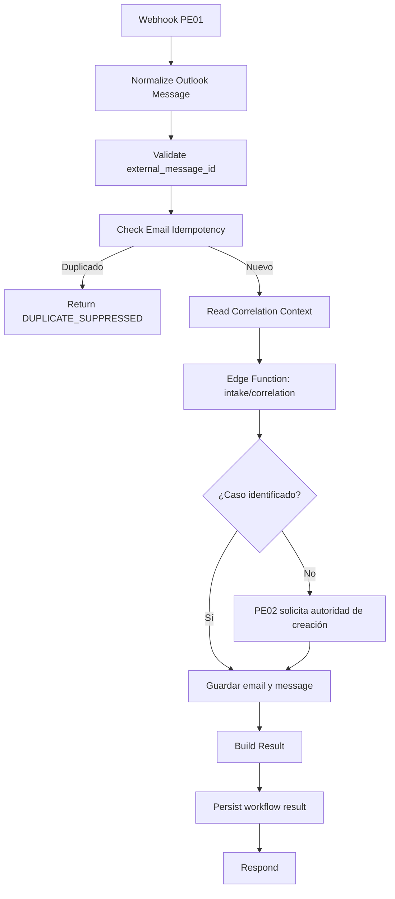

## No debe hacer

- Decidir prioridad definitiva.
- Decidir si se crea un caso sin consultar PE02/motor.
- Crear dos casos para el mismo `external_message_id`.

# 4. PE02 — Evaluate / Decision Engine

PE02 es el único workflow cuyo propósito principal es consultar al motor para decisiones de autoridad.

## Nodos a mover

- Mover el validador al inicio, después del webhook.
- Mover la lectura de `cases`, `messages`, `actions` y políticas antes del nodo de motor.
- Mover la persistencia de la decisión inmediatamente después de la respuesta del motor.
- Eliminar cualquier decisión implementada en un `Code` node de n8n.

## Nodos a crear

1. `Webhook Trigger — PE02`.
2. `Normalize Authority Request`.
3. `Check Action Idempotency`.
4. `Read Authority Context`.
5. `Call Decision Engine`.
6. `Validate Decision Schema`.
7. `Persist Authority Decision`.
8. `Create Authorized Command` solo si `authorized = true` y no requiere aprobación.
9. `Create Approval Event` si `requires_approval = true`.
10. `Build PE02 Result`.
11. `Persist PE02 Result`.
12. `Respond PE02`.
13. `PE02 Error Callback`.

## Nodo `Call Decision Engine`

Debe enviar:

```json
{
  "kind": "action",
  "context": {
    "organization_id": "uuid",
    "case": {},
    "conversation": {},
    "messages": [],
    "requested_by": "uuid"
  },
  "request": {
    "action_id": "uuid",
    "action_type": "SEND_EMAIL",
    "case_id": "uuid",
    "payload": {},
    "expected_version": 4
  }
}
```

Debe recibir una decisión explícita:

```json
{
  "authorized": true,
  "action": "SEND_EMAIL",
  "requires_approval": false,
  "reason": "La política permite el envío",
  "rule": "commercial_reply_policy",
  "rule_version": "3",
  "playbook_version": "2026.08",
  "evidence": [],
  "expected_version": 4,
  "command": {
    "type": "OUTLOOK_SEND",
    "payload": {}
  }
}
```

## Conexiones

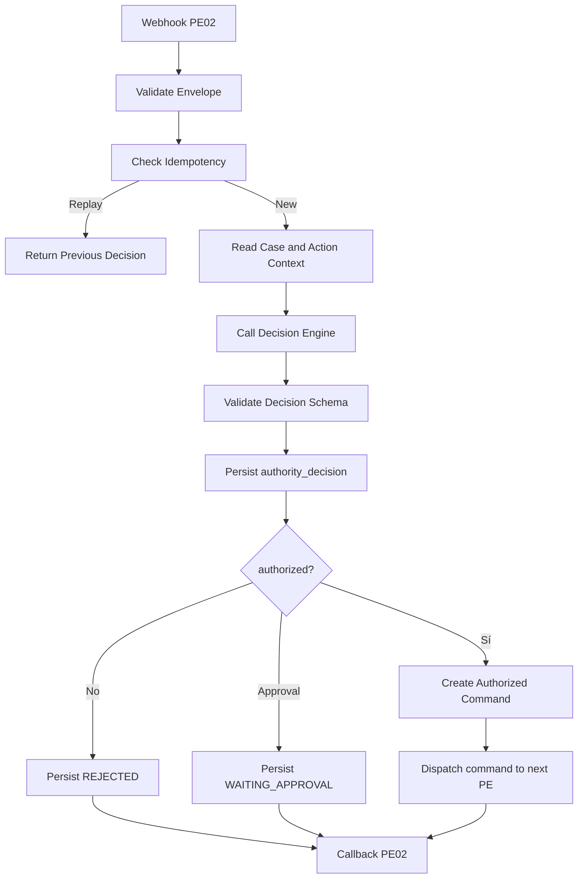

## Regla crítica

PE02 decide. Los otros workflows no deben volver a decidir si una acción es segura, sensible o autorizada.

# 5. PE03 — Reply Orchestrator

## Nodos a mover

- Mover la generación del draft después de leer el contexto.
- Mover la consulta de la decisión PE02 antes de cualquier posible entrega.
- Separar el nodo de generación IA del nodo de envío.

## Nodos a crear

1. `Read Draft Context`.
2. `Generate Draft with AI`.
3. `Persist Draft Proposal`.
4. `Read PE02 Decision`.
5. `Route Draft by Decision`.
6. `Persist PE03 Result`.

## Conexiones

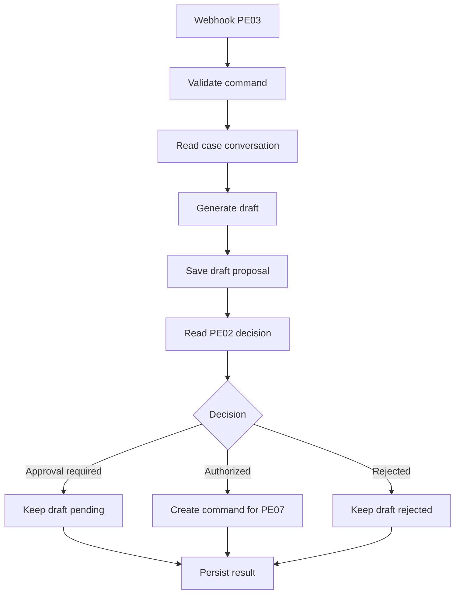

PE03 nunca envía correo ni WhatsApp.

# 6. PE04 — Delegation

## Nodos a mover

- Mover la validación de usuario/departamento antes de actualizar cualquier caso.
- Mover la lectura de la decisión PE02 antes de persistir la asignación.
- Retirar cualquier regla que decida dentro de n8n si una delegación está permitida.

## Nodos a crear

1. `Read PE02 Assignment Decision`.
2. `Validate Assignment Target`.
3. `Persist Assignment Result`.
4. `Persist Workflow Event`.
5. `Callback PE04`.

## Conexiones

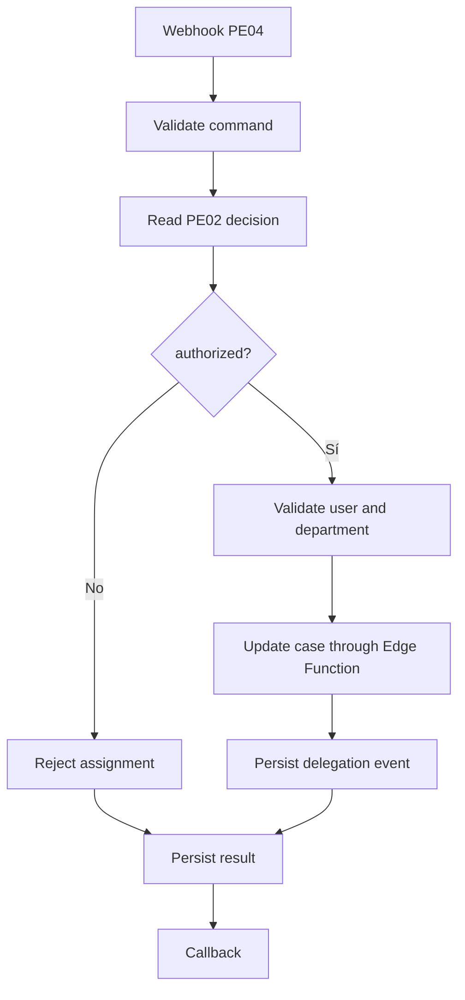

# 7. PE05 — Sent Watcher

PE05 no debe ser el chat de casos. El chat de casos usa PE13.

## Nodos a mover

- Mover la observación del mensaje enviado después de la entrega externa.
- Mover la lectura de receipts antes de cerrar el evento.

## Nodos a crear

1. `Webhook Trigger — PE05`.
2. `Read Sent Message`.
3. `Read Delivery Reference`.
4. `Create Sent Watcher Event`.
5. `Persist PE05 Event`.
6. `Callback PE05`.

## Conexiones

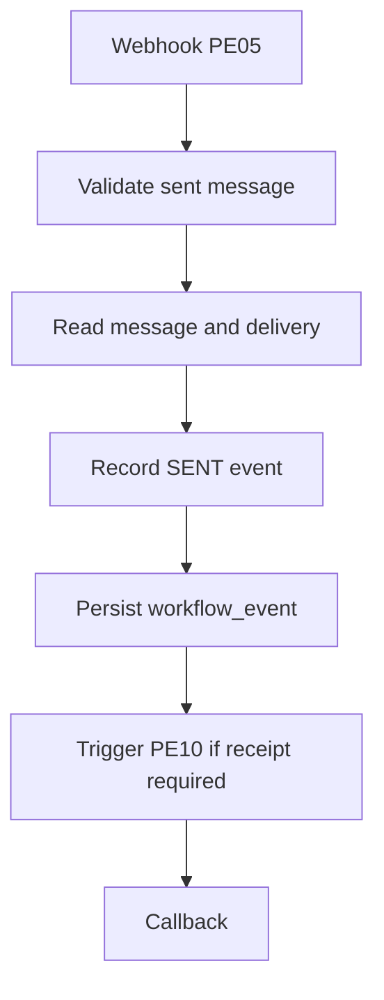

# 8. PE06 — Follow-up Clock

PE06 sí consulta al motor, pero solo para evaluar tiempos y acciones de seguimiento.

## Nodos a crear

1. `Read Follow-up Context`.
2. `Call Decision Engine — temporal`.
3. `Validate Time Decision`.
4. `Persist Follow-up Event`.
5. `Create Notification Command` si el motor lo autoriza.
6. `Persist PE06 Result`.

## Conexiones

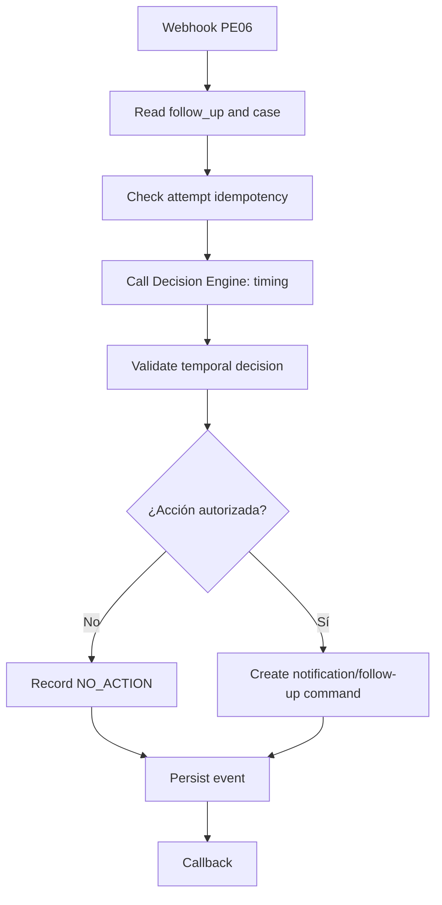

PE06 no debe convertir por sí mismo un plazo vencido en una decisión comercial.

# 9. PE07 — Delivery / WhatsApp

## Nodos a mover

- Mover la verificación de la decisión PE02 antes del proveedor externo.
- Mover `delivery_attempt` antes del envío, con estado `pending`.
- Mover el callback después de recibir la respuesta del proveedor.

## Nodos a crear

1. `Read Authorized Command`.
2. `Validate Delivery Decision`.
3. `Create Delivery Attempt`.
4. `Send External Message`.
5. `Save Provider Reference`.
6. `Build Delivery Result`.
7. `Callback PE07`.

## Conexiones

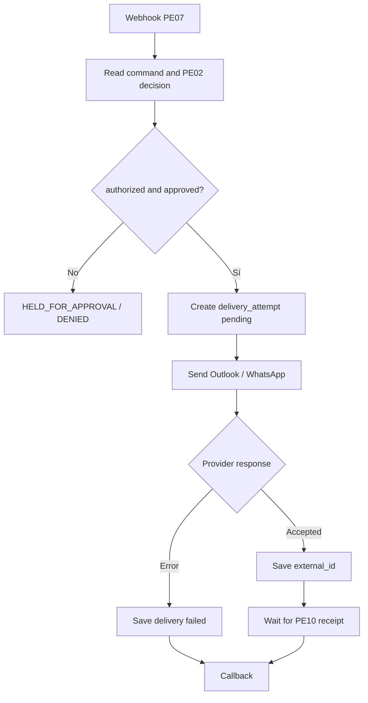

PE07 no declara confirmación definitiva de entrega. Esa responsabilidad es de PE10.

# 10. PE08 — Assistant Commands

## Nodos a mover

- Mover la detección de intención a un nodo de análisis, no de autorización.
- Mover cualquier acción sensible hacia PE02.
- Separar respuesta informativa de propuesta de acción.

## Nodos a crear

1. `Read Assistant Context`.
2. `Classify Intent`.
3. `Build Action Proposal`.
4. `Send Proposal to PE02` si la intención modifica datos o ejecuta una integración.
5. `Persist Assistant Message`.
6. `Callback PE08`.

## Conexiones

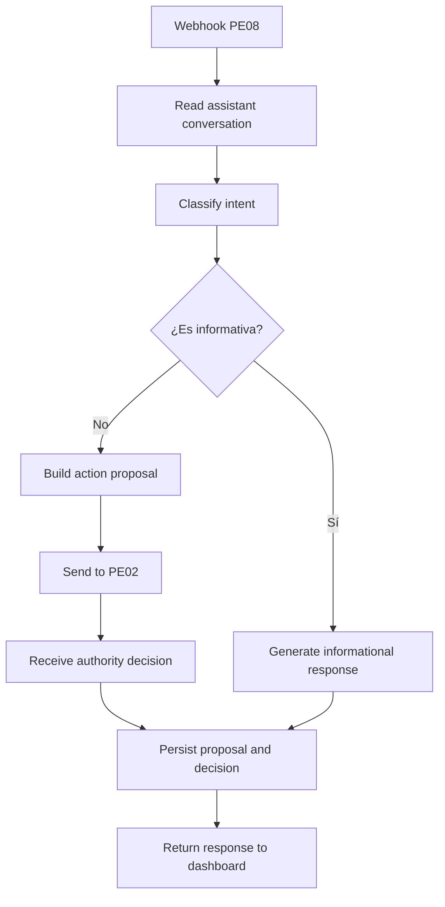

PE08 no debe aprobar, cerrar, enviar o delegar directamente.

# 11. PE09 — Case Correlation

## Nodos a mover

- Mover la búsqueda de referencias exactas antes de usar texto libre.
- Mover la decisión de ambigüedad a una ruta de atención humana.

## Nodos a crear

1. `Read External References`.
2. `Find Exact Matches`.
3. `Score Correlation Evidence`.
4. `Route Ambiguous Correlation`.
5. `Persist Correlation Event`.
6. `Callback PE09`.

## Conexiones

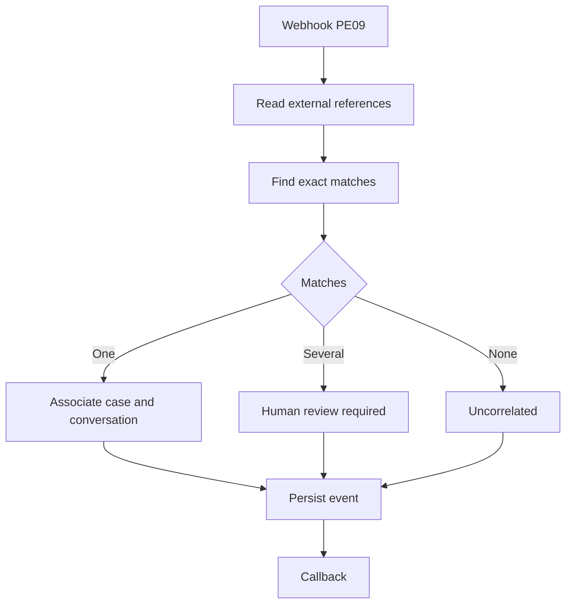

# 12. PE10 — Receipt / Retry / Reconciliation

## Nodos a mover

- Mover la lectura del receipt antes de la política de reintento.
- Mover el registro de cada intento antes de ejecutar un reintento.

## Nodos a crear

1. `Read Delivery Attempt`.
2. `Check Receipt Idempotency`.
3. `Read PE02 / Delivery Policy`.
4. `Call Decision Engine — retry` si la política necesita decisión.
5. `Update Delivery Attempt`.
6. `Create Retry Command` solo si está autorizado.
7. `Persist PE10 Event`.

## Conexiones

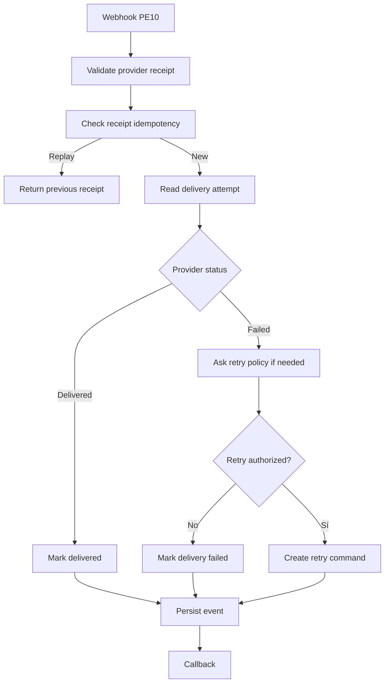

# 13. PE11 — Pulse / Coverage

## Nodos a mover

- Mover la lectura de ejecuciones y eventos a través de Edge Function.
- Eliminar snapshots locales ficticios.
- Mover la comparación de cobertura a un nodo de cálculo sin autoridad operativa.

## Nodos a crear

1. `Read Workflow Executions`.
2. `Read Workflow Events`.
3. `Read Required Sources`.
4. `Calculate Coverage Facts`.
5. `Persist Coverage Event`.
6. `Callback PE11`.

## Conexiones

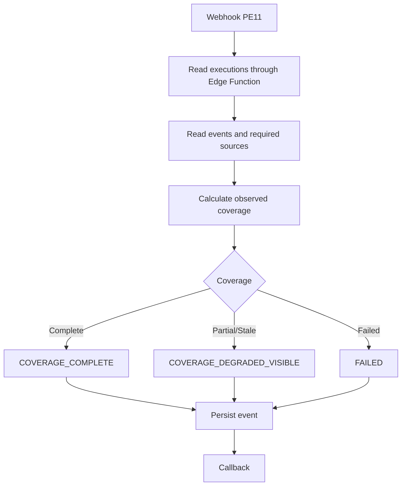

PE11 no debe aprobar, cerrar ni cambiar silenciosamente el estado de un caso.

# 14. PE12 — Verification / Closure

## Nodos a mover

- Mover la validación de evidencia antes de la transición.
- Mover la lectura de la decisión PE02 antes de cambiar el caso.
- Mover el control de `expected_version` al motor/Edge Function.

## Nodos a crear

1. `Read Current Case State`.
2. `Read PE02 Closure Decision`.
3. `Validate Evidence`.
4. `Validate Expected Version`.
5. `Apply Transition through Edge Function`.
6. `Persist System Message`.
7. `Persist PE12 Event`.
8. `Callback PE12`.

## Conexiones

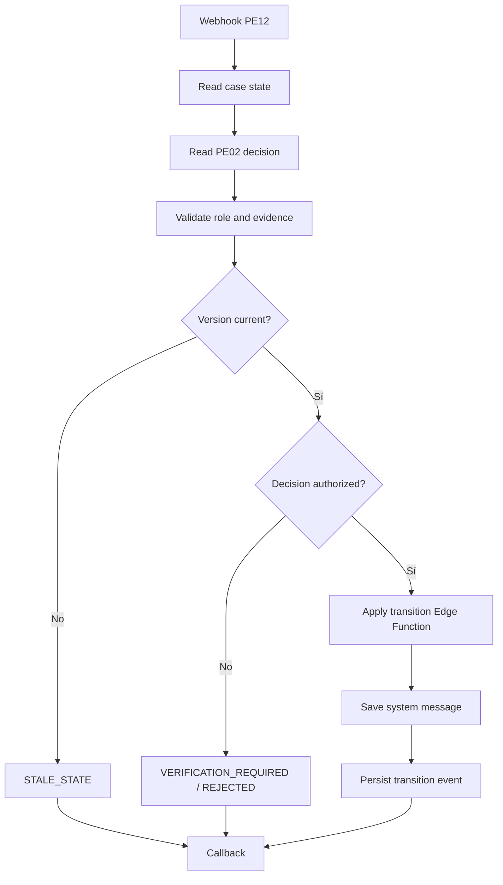

PE12 no debe cerrar un caso porque n8n recibió un `success` genérico. Debe existir una decisión PE02 compatible y evidencia válida.

# 15. PE13 — Case Conversation Orchestrator

PE13 es el flujo nuevo para el chat de `cases/[id]`. No reemplaza PE05.

## Nodos a crear

1. `Webhook Trigger — PE13`.
2. `Validate Case Conversation Envelope`.
3. `Read Case Conversation`.
4. `Read PE02 Message Decision`.
5. `Generate Assistant Response`.
6. `Build Message Result`.
7. `Persist PE13 Result`.
8. `Respond PE13`.
9. `PE13 Error Callback`.

## Conexiones

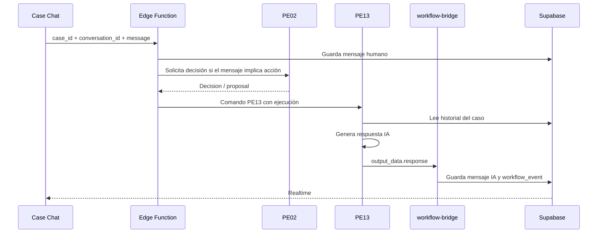

## Regla crítica

PE13 puede generar una respuesta, pero no puede autorizar una acción. Cualquier intención de enviar, cerrar, delegar o modificar datos debe volver a PE02.

# 16. Orden visual recomendado en el canvas

Para todos los workflows, ordenar los nodos de izquierda a derecha:

```text
INPUT
  → VALIDATE
  → IDEMPOTENCY
  → READ CONTEXT
  → MOTOR (solo PE02 y PE06)
  → EXECUTE / OBSERVE
  → BUILD RESULT
  → PERSIST
  → CALLBACK
  → OUTPUT
```

Separar visualmente con `Sticky Notes`:

- `INPUT — Supabase command`;
- `AUTHORITY — PE02 / Decision Engine`;
- `EXECUTION — n8n provider action`;
- `PERSISTENCE — Edge Functions only`;
- `OUTPUT — Dashboard / Realtime`.

# 17. Checklist de importación y prueba

Para cada workflow:

- [ ] El webhook tiene path único y coincide con `n8n/client.ts`.
- [ ] El nodo `Fetch injected local command` fue eliminado.
- [ ] No hay URLs `127.0.0.1` ejecutables.
- [ ] El payload original llega al validador.
- [ ] `workflow_execution_id` se conserva sin cambios.
- [ ] `organization_id` se verifica contra la ejecución.
- [ ] PE02 es el único punto de autoridad general.
- [ ] PE06 solo decide tiempos y follow-ups.
- [ ] Los demás workflows no contienen reglas de autorización.
- [ ] Las escrituras pasan por Edge Functions.
- [ ] Existe callback exitoso y callback fallido.
- [ ] El callback tiene clave idempotente.
- [ ] Se prueba el mismo payload dos veces.
- [ ] Se verifica que no se dupliquen mensajes, entregas, delegaciones ni seguimientos.
- [ ] Se prueba un `case_id` de otra organización.
- [ ] Se prueba un `expected_version` obsoleto.
- [ ] Se verifica Realtime en el dashboard.
- [ ] El workflow permanece inactivo hasta aprobar las pruebas.
