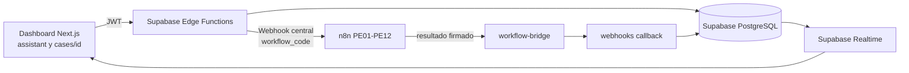
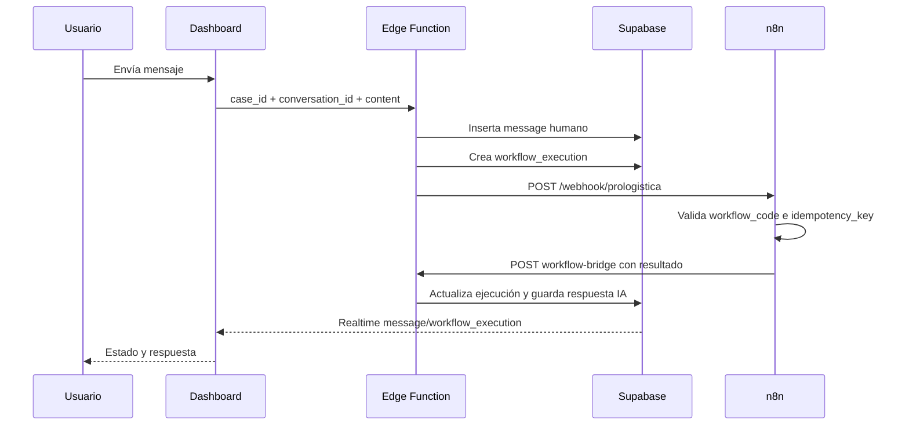
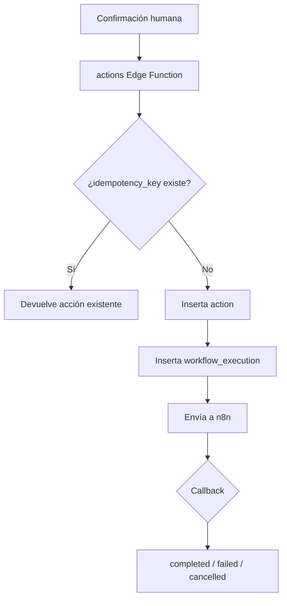
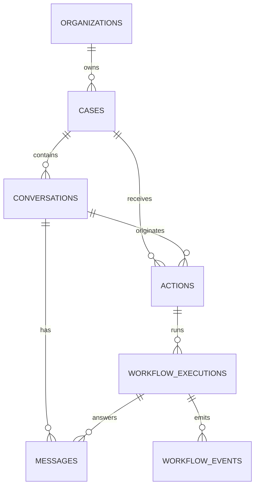

# Integración de conversaciones, casos y flujos n8n

## Objetivo

Conectar el dashboard con las conversaciones del asistente y de cada caso, usando Supabase Edge Functions como frontera segura y n8n como orquestador. La base de datos es la fuente de verdad para casos, conversaciones, mensajes, acciones y ejecuciones.

No se permite que el navegador llame directamente a n8n ni que los JSON exportados contengan secretos.

## Arquitectura



## Correlación obligatoria

Cada solicitud conserva estos identificadores:

| Campo | Uso |
|---|---|
| `organization_id` | Aislamiento multi-tenant |
| `case_id` | Caso operativo; obligatorio en chat de caso |
| `conversation_id` | Hilo exacto de conversación |
| `source_message_id` | Mensaje que inició el workflow |
| `action_id` | Acción confirmada por el usuario |
| `workflow_execution_id` | ID interno de Supabase; vínculo principal |
| `n8n_execution_id` | Referencia externa de n8n |
| `request_id` | Solicitud individual |
| `correlation_id` | Trazabilidad de todo el hilo |
| `idempotency_key` | Evita duplicados |



## Cambios en Edge Functions

### `case-messages`

Nueva función para el chat de `src/app/(dashboard)/cases/[id]/page.tsx`.

1. Valida JWT, UUID, organización y caso.
2. Busca una conversación de tipo `case` perteneciente al caso.
3. Crea la conversación si no existe.
4. Inserta el mensaje humano.
5. Crea una ejecución y la relaciona con el mensaje.
6. Solicita decisión al motor mediante PE02 y, si corresponde, envía un comando autorizado a PE13.
7. Devuelve `conversation_id`, `message_id` y `workflow_execution_id`.
8. Si n8n falla, marca la ejecución como `failed`; no inventa una respuesta de IA.

### `assistant`

Se conserva como entrada del Command Center y se refuerza la validación de propiedad de la conversación. El `case_id`, cuando existe, se conserva en el payload de n8n. Las respuestas estructuradas deben reemplazar cualquier inferencia del frontend basada en regex.

### `actions`

Cada acción crea una ejecución vinculada a `action_id`, `case_id`, `conversation_id`, `message_id` e `idempotency_key` antes de llamar a n8n.



Mapeo de acciones:

| Acción | Flujo |
|---|---|
| `approve_email`, `reject_approval` | PE02 |
| `delegate_case` | PE04 |
| `send_email` | PE07 |
| `schedule_follow_up` | PE06 |
| `resolve_case`, `verify_case`, `close_case` | PE12 |
| `execute_workflow` | `workflow_code` explícito |

### `webhooks`

El callback ahora:

- valida `x-n8n-webhook-secret`;
- busca la ejecución por `workflow_execution_id` y organización;
- rechaza ejecuciones cruzadas entre organizaciones;
- evita callbacks repetidos con `workflow_events.idempotency_key`;
- actualiza `workflow_executions` y `actions`;
- guarda respuestas de n8n en `messages` usando el `conversation_id` de la ejecución;
- actualiza aprobaciones, delegaciones y seguimientos;
- registra un evento `n8n.<workflow_code>.<status>`.

### `workflow-bridge`

Nueva frontera de persistencia para n8n. Requiere `N8N_INGRESS_SECRET`, recibe el resultado del flujo y lo reenvía a `webhooks`. Los nodos n8n solo necesitan la URL pública de esta Edge Function y sus credenciales seguras.

## Cambios en base de datos

La migración `20260825000000_n8n_conversation_integration.sql` agrega:

- `request_id`, `correlation_id`, `idempotency_key` y `source_message_id` a `workflow_executions`;
- `idempotency_key` a `workflow_events`;
- índices únicos parciales para evitar duplicados;
- trigger que actualiza `conversations.updated_at` después de insertar mensajes.



## Cambios en dashboard

### `cases/[id]/page.tsx`

- reemplaza mensajes estáticos por `messages` reales;
- localiza la conversación asociada al `case_id`;
- envía mensajes a `case-messages`;
- muestra estados de envío y error;
- mantiene el vínculo exacto entre caso y conversación.

### `assistant/page.tsx`

- carga los mensajes persistidos de la última conversación;
- transforma registros de Supabase al modelo visual existente;
- conserva `conversation_id` para solicitudes posteriores.

### `src/lib/conversations.ts`

Centraliza la lectura de conversaciones y mensajes para que ambas páginas usen el mismo orden y campos.

### Realtime

`realtime-bridge.tsx` ya escucha `cases`, `actions`, `messages` y `workflow_executions`. Los callbacks de n8n producen cambios visibles sin recargar manualmente el navegador.

## Modificaciones aplicadas a PE01–PE12

Los doce JSON fueron actualizados para eliminar las URLs de laboratorio `127.0.0.1:8765` y usar `PROLOGISTICA_EDGE_FUNCTION_URL`:

- entrada de cada export: `.../workflow-bridge?workflow_code=PEXX`; el contrato y la persistencia son centralizados, mientras que el path incluye el PE para evitar colisiones entre webhooks importados;
- persistencia/resultado: `.../workflow-bridge`;
- el trigger dejó de ser manual y ahora declara webhook POST `/prologistica`;
- el flujo mantiene el contrato Pulso y el `workflow_code` específico;
- la activación automática permanece deshabilitada (`active: false`) hasta configurar secretos y validar cada workflow en n8n.

> El nodo de lectura local queda desconectado de la ruta principal para que el cuerpo real del webhook llegue al validador. Debe eliminarse desde la interfaz de n8n al importar/guardar la versión definitiva.

### PE01 — Intake

Consulta y guarda correo, correlaciona caso, crea conversación y mensaje inicial. La clave externa del correo debe ser idempotente.

### PE02 — Autoridad

Lee caso y contexto, produce decisión, crea o actualiza aprobación y guarda el análisis. Nunca aprueba una acción sin autorización.

### PE03 — Borrador

Lee el historial y guarda un borrador IA. No marca correo como enviado.

### PE04 — Asignación

Valida usuario/departamento de la organización, actualiza el caso, crea delegación y mensaje de sistema.

### PE05 — Sent Watcher

Conserva su responsabilidad original: observar mensajes enviados y registrar el estado de salida. El chat de casos se procesa mediante PE13, después de la decisión correspondiente de PE02.

### PE06 — Seguimientos

Actualiza intento, fecha y estado de `follow_ups`; crea evento y notificación sin duplicar seguimientos.

### PE07 — Entrega

Exige aprobación, usa credenciales seguras, guarda `delivery_attempts` y espera confirmación PE10 antes de declarar entrega.

### PE08 — Asistente/commands

Lee contexto operativo y devuelve respuesta estructurada con acción opcional. Las acciones sensibles requieren confirmación humana.

### PE09 — Correlación

Busca referencias externas y asocia conversación/caso. Si hay más de una coincidencia, crea atención humana en lugar de elegir arbitrariamente.

### PE10 — Confirmación

Actualiza entrega y mensaje usando la referencia externa del proveedor. Un recibo repetido es idempotente.

### PE11 — Cobertura

Calcula cobertura de fuentes y registra eventos sin modificar silenciosamente el estado operativo del caso.

### PE12 — Verificación/cierre

Valida rol, estado actual, evidencia y versión esperada antes de verificar, resolver o cerrar. n8n no puede cerrar sin una instrucción autorizada.

## Variables necesarias en n8n y Supabase

```env
# Edge Functions
N8N_WEBHOOK_URL=https://<n8n>/api
N8N_INGRESS_SECRET=<secreto-para-entrada-desde-edge>
N8N_WEBHOOK_SECRET=<secreto-para-callback-desde-n8n>
SUPABASE_SERVICE_ROLE_KEY=<solo-en-edge-functions>

# n8n
PROLOGISTICA_EDGE_FUNCTION_URL=https://<supabase-project>.supabase.co/functions/v1
https://aqackcsunogyyyhclixh.supabase.co/functions/v1
https://aqackcsunogyyyhclixh.supabase.co/functions/v1/actions
```

Las claves nunca deben estar en `NEXT_PUBLIC_*`, en el frontend ni dentro de los JSON exportados.

## Orden de puesta en marcha

1. Aplicar la migración.
2. Configurar secretos de Edge Functions y n8n.
3. Desplegar `workflow-bridge`, `webhooks`, `case-messages`, `assistant` y `actions`.
4. Importar los JSON en n8n y eliminar los nodos locales desconectados.
5. Probar PE08, PE02 y PE13 con un caso de prueba.
6. Probar acciones PE02, PE04, PE06, PE07 y PE12.
7. Probar PE01, PE09 y PE10 con referencias externas duplicadas.
8. Activar PE11.
9. Activar workflows individualmente después de validar su callback.

## Verificación

```bash
npm run lint
npm run typecheck
npm run build
```

Validaciones adicionales:

```bash
node -e "for (const f of require('fs').readdirSync('flujos').filter(x=>x.endsWith('.json'))) JSON.parse(require('fs').readFileSync('flujos/'+f)); console.log('JSON OK')"
```

Casos mínimos de aceptación:

- un mensaje de caso aparece en la misma conversación después de recargar;
- una respuesta de n8n no puede aparecer en otro caso;
- un callback repetido no duplica mensajes, delegaciones ni seguimientos;
- una acción fallida aparece como `failed` y no como completada;
- una caída de n8n no se presenta como respuesta exitosa de IA;
- el usuario solo puede consultar datos de su organización.
